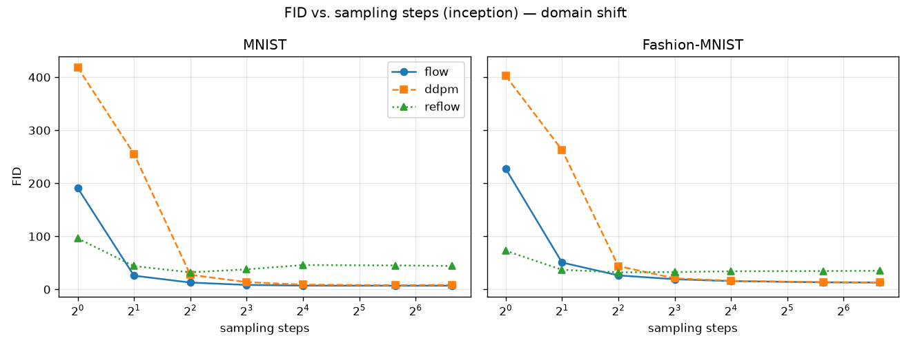
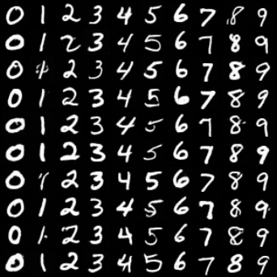
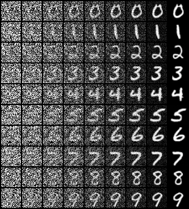

# Few-Step Image Generation: Flow Matching vs. DDPM

Single-student project for the Deep Learning course (DLAI, Sapienza).

Diffusion models (DDPM) generate great images but need **many** sampling steps. **Flow
Matching / Rectified Flow** learns a straight-line velocity field whose ODE can, in principle,
be integrated in just a handful of steps. This project builds both from scratch on MNIST,
compares them, and studies how image quality behaves as the number of sampling steps changes —
then repeats the whole thing on Fashion-MNIST to see if the conclusion survives a domain shift.



---

## Contents

- [Research question & hypothesis](#research-question--hypothesis)
- [Method](#method)
- [Key results](#key-results)
- [Repository layout](#repository-layout)
- [Install](#install)
- [Reproduce locally — step by step](#reproduce-locally--step-by-step)
- [Notebooks](#notebooks)
- [Running on Kaggle (GPU)](#running-on-kaggle-gpu)
- [Data](#data)
- [Tests](#tests)
- [Troubleshooting](#troubleshooting)
- [AI use](#ai-use)

---

## Research question & hypothesis

> **How does image quality (FID) depend on the number of sampling steps for Flow Matching
> vs. DDPM — and can *reflow* push generation to even fewer steps?**

**Hypothesis.** Flow Matching stays sharp at very few steps (2–8), while DDPM needs many more
(50+). *Add-on:* reflow straightens the sampling paths and helps at 1–2 steps.

## Method

Both models share **one** time- and class-conditioned UNet (~6.5M parameters: sinusoidal time
embedding, class embedding with a *null class* for classifier-free guidance, 3 resolution
levels, self-attention at 16×16, EMA weights for sampling). Data is MNIST / Fashion-MNIST,
resized to 32×32 and normalized to [-1, 1], **class-conditional**.

- **Flow Matching / Rectified Flow.** Interpolate `x_t = (1-t)·noise + t·data`; the network
  regresses the constant target velocity `data − noise` (MSE). Sampling integrates the ODE with
  an Euler sampler at a chosen number of steps.
- **DDPM baseline.** Linear β schedule, ε-prediction. One DDIM update covers both deterministic
  DDIM (`η=0`) and stochastic ancestral DDPM (`η=1`) on a respaced timestep schedule.
- **Reflow.** Retrain the flow model on its own `(noise, sample)` pairs to straighten paths.
- **Metrics.** Standard **InceptionV3-FID** (`pytorch-fid`) plus a lightweight **classifier-FID**
  (a small CNN trained on the dataset being evaluated — domain-matched). FID is measured
  **without** classifier-free guidance (guidance inflates FID); guidance is used only for the
  qualitative grids.

## Key results

**Flow Matching wins decisively in the few-step regime.** On MNIST, at 2 steps Flow's
InceptionV3-FID is **26 vs DDPM's 255** (~10×); at 4 steps **12.9 vs 27.6**. DDPM only catches
up around 16–50 steps. Even at **2 steps** Flow produces readable digits, while DDPM is noise:

| Flow Matching — 2 steps | DDPM — 2 steps |
|---|---|
|  |  |

**How generation works.** Each row is one digit; columns go from pure noise (left) to the
finished image (right) over 8 Euler steps:



**The advantage is robust to a domain shift** (digits → clothing on Fashion-MNIST): Flow keeps
its few-step lead, though the gap narrows and absolute quality drops on the harder, more
textured domain. Full numbers, plots and discussion are in **[`report/REPORT.md`](report/REPORT.md)**.

## Repository layout

```
flow-matching-fewstep/
├── fmfs/                 the library (importable package)
│   ├── models/unet.py       time- + class-conditioned UNet (with CFG null class)
│   ├── flow/
│   │   ├── rectified_flow.py Flow Matching: interpolation, velocity, Euler sampler, reflow
│   │   └── ddpm.py          DDPM baseline: β schedule, ε-prediction, DDPM/DDIM samplers
│   ├── data/datasets.py     MNIST & Fashion-MNIST loaders (32×32, [-1,1])
│   ├── metrics/             InceptionV3-FID + domain-matched classifier-FID
│   ├── utils/               seeds, device, EMA, plotting (grids, curves, trajectories)
│   └── inference.py         self-describing checkpoint loader
├── scripts/              command-line entry points
│   ├── train.py             train a model      (--method flow|ddpm  --dataset mnist|fashion)
│   ├── reflow.py            reflow a trained flow model
│   ├── sample.py           generate sample grids at several step counts
│   └── eval_fid.py         FID vs. step count for one or more checkpoints
├── notebooks/           01 demo · 02 full results (Kaggle) · 03 visual walkthrough
├── tests/               fast CPU tests (pytest)
├── figures/             committed figures, grouped by mnist/ · fashion/ · comparison/
├── report/REPORT.md     the 2-page write-up
├── requirements.txt     dependencies (also pyproject.toml for uv)
└── AI_USAGE.md          AI-use statement
```

**What each folder is for.** `fmfs/` is the reusable core (no side effects, unit-tested).
`scripts/` are thin command-line wrappers around it — this is what you run. `notebooks/` are for
demos and reproducing the figures. `figures/` holds the committed results so the repo tells its
story without re-running anything. `results/` (created at runtime, git-ignored) is where
checkpoints and fresh outputs land.

## Install

Local, with [uv](https://docs.astral.sh/uv/) (recommended; Python 3.11 is pinned):

```bash
cd flow-matching-fewstep
uv sync
```

All commands below use `uv run` so they pick up that environment. The device is chosen
automatically: **CUDA** if present, else Apple-Silicon **MPS**, else CPU. Prefer plain pip?
`python -m venv .venv && source .venv/bin/activate && pip install -r requirements.txt`, then
drop the `uv run` prefix.

## Reproduce locally — step by step

Everything is seeded and checkpoints store their own architecture, so each step below picks up
the previous step's output.

**1. Train the two models** (MNIST is downloaded automatically on first run):

```bash
uv run python -m scripts.train --method flow --dataset mnist --epochs 30
uv run python -m scripts.train --method ddpm --dataset mnist --epochs 30
```

Each writes `results/<method>_mnist/`: `ckpt.pt` (weights + EMA + architecture),
`loss_curve.png`, and a class-conditional `samples.png`.

**2. (Optional) reflow the flow model** to straighten its paths:

```bash
uv run python -m scripts.reflow --ckpt results/flow_mnist/ckpt.pt --pairs 50000 --epochs 30
```

**3. Generate sample grids at several step counts:**

```bash
uv run python -m scripts.sample --ckpt results/flow_mnist/ckpt.pt --steps 1,2,4,8,16,50,100
```

**4. Compute the FID-vs-steps curves** (first run downloads the InceptionV3 weights, once):

```bash
uv run python -m scripts.eval_fid \
    --ckpts flow=results/flow_mnist/ckpt.pt ddpm=results/ddpm_mnist/ckpt.pt \
    --steps 1,2,4,8,16,50,100 --n-samples 5000 --cfg-scale 1.0 --metric both
```

This writes `results/fid/fid.json` and one `fid_vs_steps_<metric>.png` per metric.

**Domain shift.** Repeat steps 1–4 with `--dataset fashion` (and `--dataset fashion` on
`eval_fid`) to get the Fashion-MNIST results.

**Prerequisites:** Python 3.11, ~2 GB disk for datasets + checkpoints, and internet on first
run (dataset + InceptionV3 download). A GPU is optional locally but strongly recommended for
the full training — see Kaggle below. Every script supports `--help`; `--max-steps N` caps a
training run for a quick smoke test, and `--epochs` trades time for quality.

## Notebooks

| notebook | what it does | intended runtime |
|----------|--------------|------------------|
| `01_demo.ipynb` | minimal end-to-end demo: train a small flow model, show few-step samples | Kaggle |
| `02_results.ipynb` | trains flow + ddpm (+ reflow), runs the full FID sweep, produces every report figure | Kaggle T4 |
| `03_walkthrough.ipynb` | visual tour with commentary: few-step grids, sampling trajectories, Flow-vs-DDPM, guidance, reflow, the domain shift, and an FID recap | local or Kaggle |

Run one locally with `uv run jupyter lab`. `03_walkthrough.ipynb` loads whatever checkpoints
exist under `results/` and is committed **with its outputs**, so you can read it like a report
without running anything.

## Running on Kaggle (GPU)

The full training + FID sweep is meant for a free Kaggle GPU.

1. New Notebook → **Settings → Accelerator: GPU T4** (see the pitfall) and **Internet: On**.
2. Upload `notebooks/02_results.ipynb` (its first cell clones this repo and installs `pytorch-fid`).
3. Run top to bottom; figures land under `results/` and render inline.

> **Pitfall:** Kaggle's default GPU is sometimes a **P100**, whose CUDA capability (sm_60) is
> not supported by the preinstalled PyTorch — training fails with
> `CUDA error: no kernel image is available for execution on the device`. Always pick a **T4**.

## Data

Both datasets are standard and downloaded automatically by `torchvision` on first use (cached
under `data/`, git-ignored):

- **MNIST** — handwritten digits, 10 classes. <http://yann.lecun.com/exdb/mnist/>
- **Fashion-MNIST** — clothing images, 10 classes, same format as MNIST, a harder domain.
  <https://github.com/zalandoresearch/fashion-mnist>

Both are used class-conditionally at 32×32, normalized to [-1, 1].

## Tests

```bash
uv run pytest        # fast CPU tests, a few seconds
```

Covers UNet forward shapes, Flow/DDPM loss + backward, samplers at several step counts, the
DDIM/ancestral `η` paths, the classifier-free-guidance path, EMA updates, sampler determinism
under a fixed seed, and the sampling-trajectory shape.

## Troubleshooting

| symptom | cause / fix |
|---------|-------------|
| `CUDA error: no kernel image ...` on Kaggle | You got a **P100** — switch the accelerator to **T4**. |
| `ModuleNotFoundError: fmfs` running a script | Run from the **repo root** as a module: `python -m scripts.train`. |
| FID step can't download InceptionV3 | Enable internet (Kaggle) or check your connection; it downloads once. |
| Dataset download fails | Same — needs internet on first run; cached afterwards under `data/`. |
| Training is slow locally | CPU/MPS is much slower than a T4 — use `--max-steps` for a smoke test, or train on Kaggle. |

## AI use

See **[`AI_USAGE.md`](AI_USAGE.md)** for the mandatory AI-use statement.
