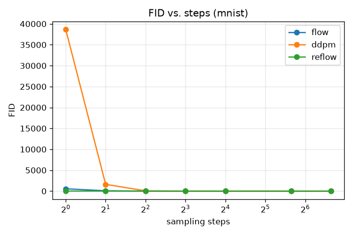

# Few-Step Image Generation: Flow Matching vs. DDPM

*DLAI, Sapienza — single-student project. Draft skeleton; FID numbers filled from the
Kaggle run (`results/fid/fid.json`), figures from `figures/`.*

## 1. Question & motivation

Diffusion models (DDPM) produce high-quality images but need many sampling steps.
Flow Matching / Rectified Flow learns a straight-line velocity field whose ODE can, in
principle, be integrated in very few steps. **Question:** how does image quality (FID)
depend on the number of sampling steps for Flow Matching vs. DDPM, and does *reflow*
straighten the paths enough to sample in even fewer steps?

**Hypothesis:** Flow Matching stays sharp at 2–8 steps; DDPM needs many steps.

## 2. Setup

- **Data.** MNIST, resized to 32×32, normalized to [-1, 1]. Class-conditional.
- **Model.** One shared time- and class-conditioned UNet (~6.5M params, 3 resolution
  levels, self-attention at 16×16, sinusoidal time embedding, label embedding with a null
  class for classifier-free guidance). EMA weights for sampling.
- **Flow Matching.** `x_t = (1-t)·noise + t·data`, target velocity `data − noise`, MSE
  loss; Euler ODE sampler with a variable step count.
- **DDPM baseline.** Linear β schedule, ε-prediction. A unified DDIM update covers
  deterministic DDIM (`η=0`) and stochastic ancestral DDPM (`η=1`) on a respaced schedule.
- **Reflow.** Retrain the flow model on its own `(noise, sample)` pairs to straighten paths.
- **Metrics.** Standard FID (InceptionV3, `pytorch-fid`) and a lightweight MNIST-FID (a
  small CNN classifier trained on MNIST). FID measured **without** classifier-free guidance
  (guidance inflates FID); guidance is used only for the qualitative grids.
- **Compute.** Trained on a Kaggle T4; developed locally on Apple Silicon.

## 3. Results

### 3.1 FID vs. sampling steps (core result)

**InceptionV3-FID** (lower is better; 3000 samples, no guidance):

| steps | 1 | 2 | 4 | 8 | 16 | 50 | 100 |
|-------|---|---|---|---|----|----|-----|
| Flow   | 191 | **25.9** | **12.9** | **8.4** | 7.1 | 6.9 | 7.0 |
| DDPM   | 419 | 255 | 27.6 | 13.7 | 9.0 | **7.8** | 8.4 |
| Reflow | **96** | 43.9 | 32.2 | 37.8 | 45.9 | 45.2 | 44.2 |

**MNIST-FID** (domain-matched classifier features):

| steps | 1 | 2 | 4 | 8 | 16 | 50 | 100 |
|-------|---|---|---|---|----|----|-----|
| Flow   | 562 | 84.4 | 9.3 | 2.3 | 2.5 | 3.6 | 4.1 |
| DDPM   | 38666 | 1617 | 67.7 | 4.4 | **2.4** | 4.5 | 5.6 |
| Reflow | **13.0** | **4.3** | 3.8 | 3.5 | 3.4 | **3.0** | 3.1 |

**Takeaways.**
- **Flow ≫ DDPM at few steps.** At 2 steps Flow's Inception-FID is 26 vs DDPM's 255 (~10×);
  at 4 steps 12.9 vs 27.6 (~2×). DDPM only catches up around 16–50 steps — exactly the
  hypothesised behaviour.
- Both plateau at a similar quality (~7 Inception-FID) once many steps are used.
- **Reflow** is the strongest at *very* few steps on the digit-identity metric (MNIST-FID 4.3
  at 2 steps, vs Flow's 84), i.e. its straightened paths nail the class in 1–2 steps — but a
  grainy background inflates its InceptionV3-FID. The two metrics thus tell complementary
  stories (identity vs. texture); reflow trained on a light budget here.

### 3.2 Sample grids: few vs. many steps

| Flow, 2 steps | Flow, 8 steps |
|---|---|
|  |  |

Flow Matching already produces clean, correctly-conditioned digits at **2 steps**.

**Sampling trajectory (noise → digit, 8 Euler steps).** Each row is one digit; columns go
from pure noise (left) to the final image (right):

### 3.3 Finding: classifier-free guidance and step count

With guidance (cfg=2.0), DDPM samples **over-saturate and degrade at high step counts**
(50–100), because deterministic guidance compounds over many steps. Without guidance
(cfg=1.0) DDPM at 100 steps is clean again. This is why FID is reported without guidance.

| DDPM 100 steps, cfg=2.0 (over-saturated) | DDPM 100 steps, cfg=1.0 (clean) |
|---|---|
|  |  |

### 3.4 Training loss

## 4. Discussion & limitations

- Flow Matching is markedly more few-step-friendly than DDPM on MNIST, as hypothesized.
- InceptionV3-FID is not ideal for grayscale MNIST (out-of-domain), hence the second,
  domain-matched MNIST-FID metric.
- **Reflow** (light budget: 20k pairs, 15 epochs) already gives the best *digit-identity* at
  1–2 steps (MNIST-FID) but a grainy background inflates its InceptionV3-FID; a heavier reflow
  run to clean the background is future work.
- CFG interacts with step count — a clean baseline comparison must fix the guidance scale.

## 5. Reproducibility

All figures are produced by `notebooks/02_results.ipynb` (runs on a Kaggle T4). Seeds are
fixed; checkpoints store their own architecture. See `AI_USAGE.md` for the AI-use statement.
