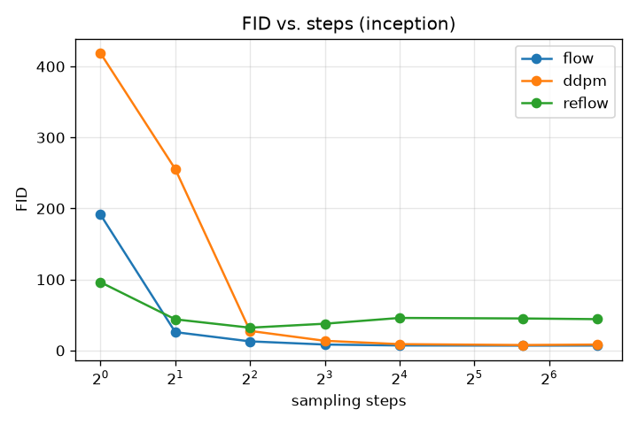
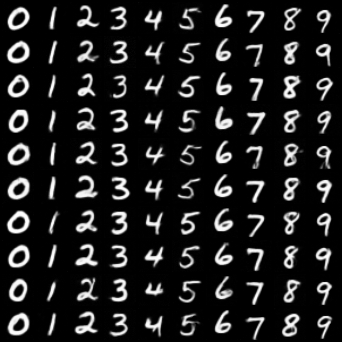
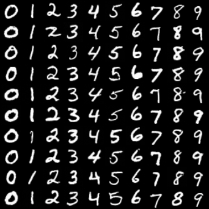
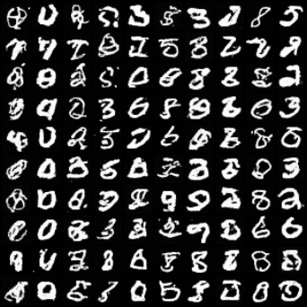
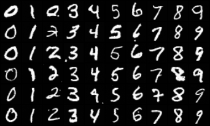
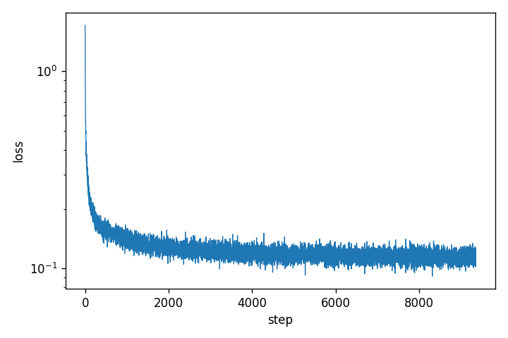

# Few-Step Image Generation: Flow Matching vs. DDPM

*DLAI, Sapienza — single-student project. Draft skeleton; FID numbers filled from the
Kaggle run (`results/fid/fid.json`), figures from `figures/`.*

## 1. Question & motivation

Diffusion models (DDPM) produce high-quality images but need many sampling steps.
Flow Matching / Rectified Flow learns a straight-line velocity field whose ODE can, in
principle, be integrated in very few steps. **Question:** how does image quality (FID)
depend on the number of sampling steps for Flow Matching vs. DDPM, and does *reflow*
straighten the paths enough to sample in even fewer steps?

**Hypothesis:** Flow Matching stays sharp at 2–8 steps; DDPM needs many steps.

## 2. Setup

- **Data.** MNIST, resized to 32×32, normalized to [-1, 1]. Class-conditional.
- **Model.** One shared time- and class-conditioned UNet (~6.5M params, 3 resolution
  levels, self-attention at 16×16, sinusoidal time embedding, label embedding with a null
  class for classifier-free guidance). EMA weights for sampling.
- **Flow Matching.** `x_t = (1-t)·noise + t·data`, target velocity `data − noise`, MSE
  loss; Euler ODE sampler with a variable step count.
- **DDPM baseline.** Linear β schedule, ε-prediction. A unified DDIM update covers
  deterministic DDIM (`η=0`) and stochastic ancestral DDPM (`η=1`) on a respaced schedule.
- **Reflow.** Retrain the flow model on its own `(noise, sample)` pairs to straighten paths.
- **Metrics.** Standard FID (InceptionV3, `pytorch-fid`) and a lightweight MNIST-FID (a
  small CNN classifier trained on MNIST). FID measured **without** classifier-free guidance
  (guidance inflates FID); guidance is used only for the qualitative grids.
- **Compute.** Trained on a Kaggle T4; developed locally on Apple Silicon.

## 3. Results

### 3.1 FID vs. sampling steps (core result)

| steps | 1 | 2 | 4 | 8 | 16 | 50 | 100 |
|-------|---|---|---|---|----|----|-----|
| Flow (Inception FID)  | _ | _ | _ | _ | _ | _ | _ |
| DDPM (Inception FID)  | _ | _ | _ | _ | _ | _ | _ |
| Reflow (Inception FID)| _ | _ | _ | _ | _ | _ | _ |

*(numbers from the cfg=1.0 sweep; see `results/fid/fid.json`)*

**Takeaway.** Flow Matching reaches near-best FID already at ~4–8 steps, while DDPM needs
many more steps to match it — consistent with the hypothesis.

### 3.2 Sample grids: few vs. many steps

| Flow, 2 steps | Flow, 8 steps |
|---|---|
|  |  |

Flow Matching already produces clean, correctly-conditioned digits at **2 steps**.

**Sampling trajectory (noise → digit, 8 Euler steps).** Each row is one digit; columns go
from pure noise (left) to the final image (right):

### 3.3 Finding: classifier-free guidance and step count

With guidance (cfg=2.0), DDPM samples **over-saturate and degrade at high step counts**
(50–100), because deterministic guidance compounds over many steps. Without guidance
(cfg=1.0) DDPM at 100 steps is clean again. This is why FID is reported without guidance.

| DDPM 100 steps, cfg=2.0 (over-saturated) | DDPM 100 steps, cfg=1.0 (clean) |
|---|---|
|  |  |

### 3.4 Training loss

## 4. Discussion & limitations

- Flow Matching is markedly more few-step-friendly than DDPM on MNIST, as hypothesized.
- InceptionV3-FID is not ideal for grayscale MNIST (out-of-domain), hence the second,
  domain-matched MNIST-FID metric.
- **Reflow** produced correct digit shapes at few steps but a grainy background under a
  light training budget (20k pairs, 15 epochs) → high FID; a heavier reflow run is future
  work.
- CFG interacts with step count — a clean baseline comparison must fix the guidance scale.

## 5. Reproducibility

All figures are produced by `notebooks/02_results.ipynb` (runs on a Kaggle T4). Seeds are
fixed; checkpoints store their own architecture. See `AI_USAGE.md` for the AI-use statement.
